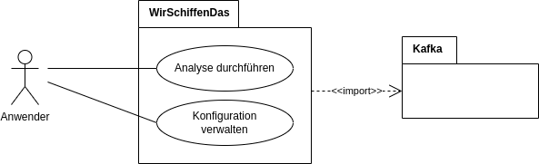
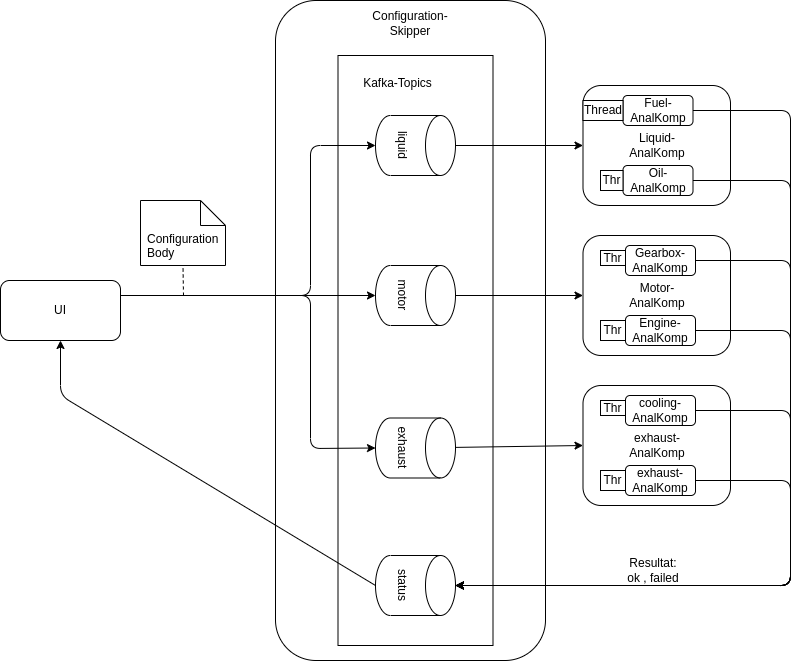

# Migration einer monolithischen Architektur auf Microservices

- [Migration einer monolithischen Architektur auf Microservices](#migration-einer-monolithischen-architektur-auf-microservices)
  - [Application](#application)
  - [Architecture](#architecture)
    - [Context View](#context-view)
    - [Development View](#development-view)
    - [Sequence View](#sequence-view)
    - [Deployment View](#deployment-view)
    - [Context View: Kafka Communication Channels](#context-view-kafka-communication-channels)
  - [Projekt Struktur](#projekt-struktur)
  - [Projekt Setup](#projekt-setup)
  - [Deployment](#deployment)
  - [Lessons learned](#lessons-learned)

by Florian Weber & Thomas Jonas

## Application


## Architecture

The following 5 diagrams describe:
- Context View: High level
- Development View
- Sequence View
- Deployment View
- Context View: Kafka Communication Channels

### Context View



WirSchaffenDas is the system we developed.\
It uses an external Kafka Broker, and can be accessed by a user via a web browser.

### Development View


"WirSchaffenDas" consist of two main components:
- Analysis GUI
- Algorithm Components

The Analysis GUI is a web application, which can be accessed by a user via a web browser.\
It is responsible for displaying the results of the analysis.

The Algorithm Components are responsible for the actual analysis.\
They are implemented as microservices, and communicate via Kafka.\
Each Algorithm Component is responsible for one specific analysis algorithm.


### Sequence View


The following sequence diagram shows the program flow of the analysis GUI.\
The user can select an analysis algorithm, and start the analysis.\
The analysis GUI then sends a request to the selected algorithm component.\
The algorithm component then starts consuming messages from the kafka topic.\
The algorithm component then starts the analysis, and sends the results back to the analysis GUI.\
The analysis GUI then displays the results to the user.

### Deployment View


The following deployment diagram shows the deployment of the analysis GUI and the algorithm components.\
The analysis GUI is deployed as a web application, and can be accessed by a user via a web browser.\
The algorithm components are deployed as microservices, and communicate via Kafka.\
Each algorithm component is deployed as a seperate service, and can be scaled individually.

### Context View: Kafka Communication Channels



The following diagram shows the communication channels between the algorithm components and kafka.\
Each algorithm component consumes messages from a specific kafka topic.\
Each algorithm component produces messages to a specific kafka topic.\
The analysis GUI produces messages to a specific kafka topic.\
The analysis GUI consumes messages from a specific kafka topic.


## Projekt Struktur

Beispielhaft:

- kafka_stream_visualizer: Kafka Visualisierung aus Florians Bachelorarbeit
- microservice_architecture: Microservice-Migration der WirSchaffenDas Ausgangsarchitektur
- kafka
- (docker)

*Um den Ueberblick zu behalten*

## Projekt Setup

- Requirements zum Ausfuehren. zb Java Version
- Installationsanleitung. zb. JDK oder Docker

## Deployment

0. Connect to HBRS-VPN to enable access to the kafka-cluster.
1. Execute services in seperate shells/processes.
2. Start kafka-consumer in each algorithm component.
3. Navigate to GUI and start the analysis.


1. Start services

```bash
# In each alg_comp directory run:
./gradlew bootRun

# Deploy analysis GUI (in analyse-dashboard directory)
bash ./mvnw

```

2. 

To start the kafka-consumer in each algorithm component,\
their `/startConsuming`-endpoint has to be called explicitly.

```bash
# Check if server is up
curl 'http://localhost:8081/healthCheck'

# Start consuming messages from kafka topic
curl 'http://localhost:8081/startConsumingKafka'
```


## Lessons learned

- Importance of `Communication` when planning and executing a project.
- Complexity of dependency management.
- Curcuit-breaker integration.
- Automated deployment.
- Containerization.
