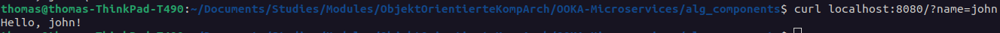

## Project Setup

- Make sure u have the correct `jdk version` installed.
- Initialize project with `spring initializer` -> Gradle
- Choose correct `dependencies` in spring initializer.
- Use `Gradle`-Extension on sidebar for building and running application. (vscode has to be launched from subproject root folder.)
  

## Endpoint usage

